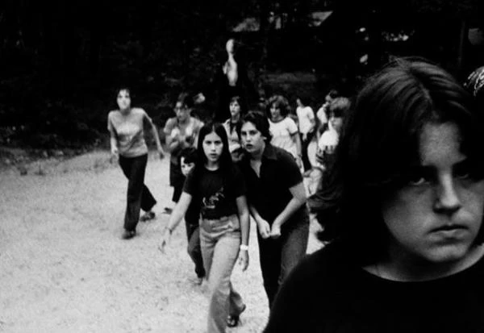
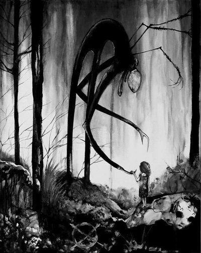

<blockquote>
«What if you were unable to wake from that dream? How would you know the difference between the dream world and the real world?»   Матрица (The Matrix)
</blockquote>

В далёком 2009 году. На форуме Something Awful в рамках конкурса Create Paranormal Images в Jun 10, 2009 14:07 от пользователя Victor Surge появилось c виду ничем не примечательное изображение.

"we didn't want to go, we didn't want to kill them, but its persistent silence and outstretched arms horrified and comforted us at the same time..."
(1983, photographer unknown, presumed dead.)

Однако, внимательный глаз замечал на заднем фоне что-то крайне неестественное. Это больше напоминало артефакт камеры или игру света, но приписка наполняла его мрачным смыслом.

С этого момента выдуманный монстр вышел на охоту. 

Интернет стал порождать больше новых слухов и новых изображений. Теперь эту фигуру можно было разглядеть уже намного лучше.

Постепенная тревога стала перерастать в панику, теперь обеспокоенным люди стал мерещиться монстр уже рядом со своими домами... 

Со временем паника спала, и её начали вспоминать с лёгкой усмешкой. Банальная история массовой паники вокруг выдуманного монстра.

Однако, люди кое-что упустили из вида.

Просматривая комментарии на форумах и под стримами можно найти не мало интересных историй.

Вот одна крайне показательная. 

И всё же этот монстр имеет какую-то степень реальности, просто посмотрите как он уютно устроился в бессознательном этой девушки. Какое-то время он тихо ждал, дожидаясь удобного момента, напоминая о себе лишь редкими мельканиями среди деревьев и звуком шагов где-то на периферии восприятия. И однажды он дождался того самого момента, утомлённая и ослабленная психика не смогла отогнать его, и вот тогда, он перешагнул грань реальности, показав себя во всей своей кошмарной красе. В эти короткие мгновения он стал таким же реальным ...

Спите спокойно, дети, теперь вы знаете, что монстры проникают в ваш разум только когда вам страшно. Не бойтесь. 

